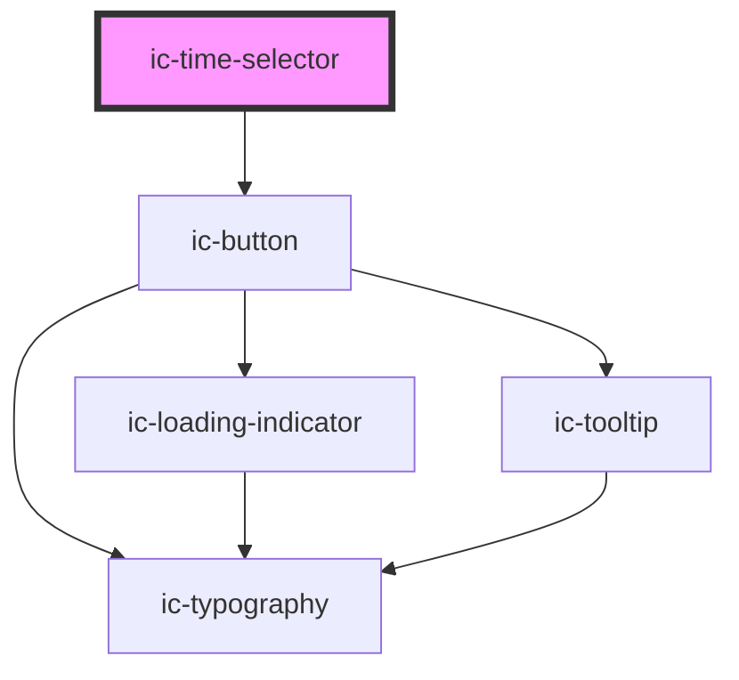

# ic-time-selector

<!-- Auto Generated Below -->

## Properties

| Property     | Attribute     | Description                                                                                                                                                             | Type                                          | Default                    |
| ------------ | ------------- | ----------------------------------------------------------------------------------------------------------------------------------------------------------------------- | --------------------------------------------- | -------------------------- |
| `theme`      | `theme`       | Sets the theme color to the dark or light theme color. "inherit" will set the color based on the system settings or ic-theme component.                                 | `"dark" \| "inherit" \| "light" \| undefined` | `"inherit"`                |
| `timeFormat` | `time-format` | The format in which the time will be displayed.                                                                                                                         | `"HH:MM" \| "HH:MM:SS"`                       | `this.DEFAULT_TIME_FORMAT` |
| `value`      | `value`       | The value of the time selector. The value can be in any format supported as `timeFormat`, in ISO 8601 time string format (`HH:MM:SS`) or as a JavaScript `Date` object. | `Date \| null \| string \| undefined`         | `""`                       |

## Events

| Event      | Description                         | Type                                                                                                                           |
| ---------- | ----------------------------------- | ------------------------------------------------------------------------------------------------------------------------------ |
| `icChange` | Emitted when the value has changed. | `CustomEvent<{ value: Date \| null; timeObject: { hour: string \| null; minute: string \| null; second: string \| null; }; }>` |

## Dependencies

### Depends on

- ic-button

### Graph

----------------------------------------------

